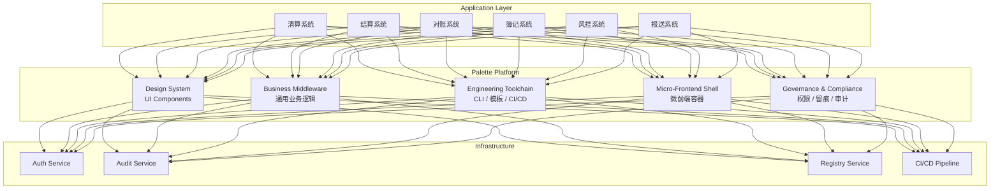
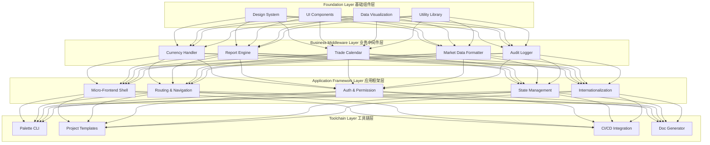
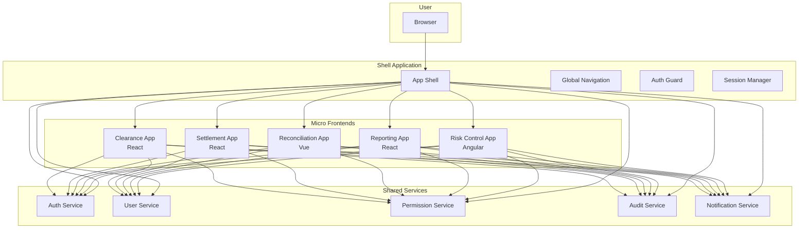
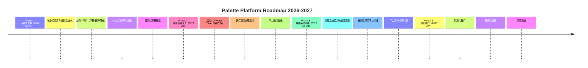

# Palette Enterprise UI Platform Presentation Structure

> **文档类型**：演示文稿结构（Slide-by-Slide Outline）  
> **目标受众**：架构委员会、技术领导、Post Trade 业务组、应用负责人、工程团队  
> **核心定位**：Palette — Enterprise Frontend Application Platform for Post Trade  
> **价值主张**：Accelerating secure, consistent and scalable application delivery  
> **编制日期**：2026-07-19

---

## Slide 1 — Title Page

### Palette Enterprise UI Platform

### Building a Unified Frontend Foundation for Post Trade Applications

**演讲要点：**

-   **标题**：Palette Enterprise UI Platform
    
-   **副标题**：Building a Unified Frontend Foundation for Post Trade Applications
    
-   **汇报对象**：Architecture Committee | Tech Leadership | Post Trade Business Teams | Application Owners | Engineering Teams
    
-   **汇报时长提示**：约 40 分钟（含 Q&A）
    

**Speaker Notes：**

> 本页是开场页，建议在 1 分钟内完成。重点强调"**平台**"而非"组件库"的定位，用一句话点明核心价值主张：Accelerating secure, consistent and scalable application delivery。开场时可以先简要说明本次汇报的背景——Post Trade 领域正面临清算系统升级换代的关键窗口期，前端平台化是支撑这一变革的基础设施。

---

## Slide 2 — Agenda

### 议程概览

**演讲要点：**

<table data-fit-width="true" style="min-width: 0px; width: auto;"><colgroup><col style="min-width: 35px;"><col style="min-width: 35px;"><col style="min-width: 35px;"></colgroup><tbody><tr><th colspan="1" rowspan="1">
章节
</th><th colspan="1" rowspan="1">
内容
</th><th colspan="1" rowspan="1">
页数
</th></tr><tr><td colspan="1" rowspan="1">
1
</td><td colspan="1" rowspan="1">
问题与挑战 — Post Trade 前端现状与痛点
</td><td colspan="1" rowspan="1">
Slide 3-4
</td></tr><tr><td colspan="1" rowspan="1">
2
</td><td colspan="1" rowspan="1">
平台定位与愿景 — Palette 是什么、不是什么
</td><td colspan="1" rowspan="1">
Slide 5-6
</td></tr><tr><td colspan="1" rowspan="1">
3
</td><td colspan="1" rowspan="1">
平台核心能力 — 组件、中间件、工具链
</td><td colspan="1" rowspan="1">
Slide 7-9
</td></tr><tr><td colspan="1" rowspan="1">
4
</td><td colspan="1" rowspan="1">
Post Trade 专项支撑 — 微前端、合规、安全
</td><td colspan="1" rowspan="1">
Slide 10-11
</td></tr><tr><td colspan="1" rowspan="1">
5
</td><td colspan="1" rowspan="1">
业务价值与交付效率 — 量化收益与案例
</td><td colspan="1" rowspan="1">
Slide 12-13
</td></tr><tr><td colspan="1" rowspan="1">
6
</td><td colspan="1" rowspan="1">
技术架构 — 分层架构与关键设计
</td><td colspan="1" rowspan="1">
Slide 14-15
</td></tr><tr><td colspan="1" rowspan="1">
7
</td><td colspan="1" rowspan="1">
分阶段实施路线图 — 研发、试点、迁移、推广
</td><td colspan="1" rowspan="1">
Slide 16-17
</td></tr><tr><td colspan="1" rowspan="1">
8
</td><td colspan="1" rowspan="1">
组织与治理 — 团队、贡献机制、版本策略
</td><td colspan="1" rowspan="1">
Slide 18
</td></tr><tr><td colspan="1" rowspan="1">
9
</td><td colspan="1" rowspan="1">
总结与下一步 — 决策事项与行动项
</td><td colspan="1" rowspan="1">
Slide 19
</td></tr></tbody></table>

**Speaker Notes：**

> 用 30 秒快速过一遍议程，让听众对整体结构有预期。强调"问题驱动"的逻辑——先讲清楚为什么需要平台，再讲平台是什么、怎么做。建议在讲完议程后，用一句话过渡："让我们先从 Post Trade 前端面临的真实挑战开始。"

---

## Slide 3 — Problem & Challenges (1/2)

### Post Trade 前端现状：碎片化之困

**演讲要点：**

-   **业务场景的复杂性**
    
    -   清算、结算、对账、簿记、风控、报送等多个子系统各自独立建设
        
    -   每个子系统有不同的技术栈、UI 风格和交互范式
        
    -   用户（运营人员）需要在多个系统间频繁切换，体验割裂
        
-   **重复建设严重**
    
    -   每个子系统都在重复实现：权限控制、操作留痕、报表导出、币种处理、交易日历、市场数据格式化
        
    -   估算：**60%-70%** 的前端代码在多个系统间重复
        
    -   新子系统从零搭建，平均需要 **4-6 个月** 才能达到可交付状态
        
-   **合规与风控压力**
    
    -   监管报送交互要求严格一致
        
    -   操作留痕需要标准化审计链路
        
    -   细粒度权限控制（功能级 + 数据级）每个系统各自实现，标准不一
        

**Speaker Notes：**

> 本页是"制造危机感"的关键页。用实际的业务场景描述让听众感同身受——建议讲一个具体的运营人员日常工作场景："一个运营人员早上打开清算系统看结果，切到对账系统核对差异，再切到报送系统做监管报告——三个系统长得完全不一样，操作方式也不同，学习成本极高。" 数据部分（60%-70% 重复代码、4-6 个月搭建周期）可以用加粗强调，但注意说明为内部估算。

---

## Slide 4 — Problem & Challenges (2/2)

### 行业对标与交付效率瓶颈

**演讲要点：**

-   **行业对标数据**
    
    -   恒生新一代内存清算系统在国金证券上线后，**清算时长缩短 75%**
        
    -   金证 FS2.5 定位为"集团级全资产清算簿记底座"，支持多法人、存算分离、信创兼容
        
    -   行业趋势：**内存清算、存算分离、全资产统一簿记、智能化运营、信创适配**
        
-   **前端交付效率的瓶颈**
    
    -   从需求提出到前端上线，平均周期 **8-12 周**
        
    -   后端接口就绪后，前端仍需 **4-6 周** 完成页面开发与联调
        
    -   缺乏统一的前端脚手架和项目模板，每个项目从零配置
        
    -   UI 走查与合规审查反复返工，占用 **20%-30%** 的开发时间
        
-   **核心问题归纳**
    
    > 业务侧正在加速（内存清算、全资产簿记），但前端交付能力没有跟上——这是当前最大的效率瓶颈。
    

**Speaker Notes：**

> 本页延续上一页的"痛点"主题，引入行业对标数据来建立紧迫感。重点强调"业务侧在加速，前端没跟上"这个核心矛盾。行业数据（恒生 75% 提升、金证 FS2.5）作为公开信息引用，用于说明整个 Post Trade 领域正在经历技术升级，前端平台化是顺势而为。过渡到下一页："解决这些问题的关键，不是再做一个组件库，而是构建一个真正的企业级前端应用平台——这就是 Palette。"

---

## Slide 5 — Platform Vision (1/2)

### Palette 平台定位：不是组件库，是应用平台

**演讲要点：**

-   **Palette 不是什么**
    
    -   ❌ 不是"又一个前端组件库"（市面上已有 Ant Design、Element Plus 等）
        
    -   ❌ 不是"强制统一的技术框架"（不限制团队技术选型自由）
        
    -   ❌ 不是"一次性交付的静态工具"（是持续演进的平台生态）
        
-   **Palette 是什么**
    
    -   ✅ **企业级前端应用平台** — 面向 Post Trade 领域的完整前端解决方案
        
    -   ✅ **应用交付底座** — 提供从开发到部署的全链路支撑
        
    -   ✅ **业务能力复用层** — 将证券业务通用逻辑沉淀为可复用中间件
        
    -   ✅ **标准化治理框架** — 统一 UI/UX 标准、合规基线、工程规范
        
-   **核心价值主张**
    
    > **Accelerating secure, consistent and scalable application delivery.**
    

**Speaker Notes：**

> 本页是"正名"页——听众可能会问"这不就是做个组件库吗？"所以必须在一开始就清晰定义 Palette 的定位。用"不是什么/是什么"的对比结构，快速消除误解。强调"平台"的三大特征：可复用、可演进、可治理。最后用核心价值主张收尾，为下一页的愿景做铺垫。

---

## Slide 6 — Platform Vision (2/2)

### 目标架构蓝图与愿景

**演讲要点：**

-   **目标架构蓝图**
    

-   **愿景陈述**
    
    > 成为 Post Trade 领域首选的标准化前端应用平台，让业务团队以 **更少的重复、更快的速度、更高的质量** 交付企业级应用。
    
-   **成功标准（2026-2027 目标）**
    
    -   新子系统从立项到上线的前端交付周期缩短 **50%** 以上
        
    -   平台组件与中间件复用率达到 **70%** 以上
        
    -   零合规返工——通过平台内置的合规基线自动满足监管要求
        

**Speaker Notes：**

> 本页展示目标架构蓝图，建议用 2-3 分钟讲解。先解释架构图的分层逻辑：底层是基础设施服务，中间是 Palette 平台的五大核心能力层，上层是各类 Post Trade 应用。强调"所有应用共享同一平台底座"的核心思想。愿景部分用一句话概括，成功标准给出可衡量的量化目标，为后续的 Slide 12（业务价值）埋下伏笔。

---

## Slide 7 — Core Capabilities (1/3)

### 基础组件与设计系统

**演讲要点：**

-   **设计系统（Design System）**
    
    -   统一的视觉语言：色彩体系、字体规范、间距网格、图标库
        
    -   面向 Post Trade 的专业组件：数据表格、KPI 卡片、监控面板、图表组件
        
    -   暗色模式与高对比度模式支持（运营人员长时间使用）
        
-   **核心组件库**
    
    -   基础组件：Button、Input、Select、Modal、Toast 等（基于 Ant Design 封装，保持一致性）
        
    -   业务组件：SearchForm、EditableTable、DetailPanel、StepWizard、DashboardGrid
        
    -   数据可视化组件：时间序列图、K线图、资产分布图、实时监控仪表盘
        
-   **设计原则**
    
    -   一致性：统一的交互模式与视觉风格
        
    -   可访问性：符合 WCAG 2.1 AA 标准
        
    -   可主题化：支持品牌定制与信创适配
        
    -   文档化：Storybook 在线预览 + 使用指南 + 最佳实践
        

**Speaker Notes：**

> 进入"核心能力"章节。本页讲基础组件和设计系统，建议控制在 2 分钟内。强调"不只是组件，而是设计系统"——组件只是载体，背后的设计规范、交互模式、文档化体系才是真正的价值。可以展示一个具体的业务组件（如数据表格的搜索、排序、筛选、导出、列配置等开箱即用功能）来说明"开箱即用"的体验。过渡到下一页："但组件只是冰山一角，Palette 的真正差异化在于对证券业务场景的深度封装——业务中间件。"

---

## Slide 8 — Core Capabilities (2/3)

### 业务中间件与通用逻辑库 — 核心差异化

**演讲要点：**

-   **什么是业务中间件？**
    
    > 针对证券 Post Trade 业务场景封装的通用逻辑模块，让开发者无需重复实现行业特有的业务规则。
    
-   **核心业务中间件清单**
    

<table data-fit-width="true" style="min-width: 0px; width: auto;"><colgroup><col style="min-width: 35px;"><col style="min-width: 35px;"><col style="min-width: 35px;"></colgroup><tbody><tr><th colspan="1" rowspan="1">
中间件
</th><th colspan="1" rowspan="1">
功能说明
</th><th colspan="1" rowspan="1">
解决痛点
</th></tr><tr><td colspan="1" rowspan="1">
<strong>币种处理</strong>
</td><td colspan="1" rowspan="1">
多币种格式化、汇率转换、货币符号映射、金额精度控制
</td><td colspan="1" rowspan="1">
每个系统重复实现币种逻辑，且精度处理不一致导致数据差异
</td></tr><tr><td colspan="1" rowspan="1">
<strong>报表导出引擎</strong>
</td><td colspan="1" rowspan="1">
支持 Excel/PDF/CSV 导出，模板化管理，大数据量分片导出
</td><td colspan="1" rowspan="1">
各系统导出逻辑不统一，用户反馈格式不一致
</td></tr><tr><td colspan="1" rowspan="1">
<strong>交易日历</strong>
</td><td colspan="1" rowspan="1">
多市场交易日历、节假日管理、交收日计算、T+N 推算
</td><td colspan="1" rowspan="1">
交易日逻辑复杂，每个系统实现容易出错
</td></tr><tr><td colspan="1" rowspan="1">
<strong>市场数据格式化</strong>
</td><td colspan="1" rowspan="1">
行情数据格式化、涨跌幅计算、价格精度控制、单位换算
</td><td colspan="1" rowspan="1">
不同市场数据格式各异，前端展示混乱
</td></tr><tr><td colspan="1" rowspan="1">
<strong>操作留痕组件</strong>
</td><td colspan="1" rowspan="1">
标准化操作审计日志、用户行为追踪、合规审计报表
</td><td colspan="1" rowspan="1">
各系统留痕标准不一，审计时难以追溯
</td></tr><tr><td colspan="1" rowspan="1">
<strong>权限控制组件</strong>
</td><td colspan="1" rowspan="1">
功能级权限 + 数据级权限 + 按钮级权限的统一方案
</td><td colspan="1" rowspan="1">
权限模型各自实现，维护成本高
</td></tr></tbody></table>

-   **设计原则**
    
    -   可配置化：通过配置而非代码满足不同场景需求
        
    -   可扩展：支持自定义逻辑注入
        
    -   开箱即用：API 简洁，文档完善
        

**Speaker Notes：**

> 本页是"全场最核心的差异化页"，建议用 3-4 分钟详细讲解。重点强调"业务中间件"——这是 Palette 区别于普通组件库的最大差异。建议选 1-2 个中间件举例说明（如"币种处理"：一个运营人员在查看跨境交易时，需要同时看到人民币、港币、美元三种计价，不同市场和产品的精度要求不同——没有中间件就需要每个系统各自实现一套，而且很容易出现精度不一致的问题）。表格中的每个中间件都可以快速带过，但"币种处理"和"操作留痕"可以稍作展开，因为它们分别对应"业务价值"和"合规价值"两个维度。

---

## Slide 9 — Core Capabilities (3/3)

### 工程化脚手架与工具链

**演讲要点：**

-   **CLI 工具（Palette CLI）**
    
    -   `palette create` — 一键创建标准项目模板，包含完整工程配置
        
    -   `palette add` — 添加组件、中间件、页面模板
        
    -   `palette build` — 标准化构建流程，集成代码检查、测试、构建
        
    -   `palette publish` — 组件/中间件发布到内部 Registry
        
    -   `palette upgrade` — 平台版本升级检测与自动迁移
        
-   **标准化项目模板**
    
    -   统一的项目结构规范（目录组织、命名规范、代码风格）
        
    -   内置 ESLint、Prettier、Commitlint 配置
        
    -   集成单元测试（Jest/Vitest）+ E2E 测试（Playwright）
        
    -   内置 Docker 开发环境配置
        
-   **CI/CD 集成**
    
    -   标准化 CI Pipeline：Lint → Test → Build → Deploy
        
    -   自动化组件文档生成（基于 JSDoc/TypeScript 类型）
        
    -   自动化版本发布与变更日志生成
        
    -   质量门禁：代码覆盖率 > 80%，无 Critical/High 级别漏洞
        
-   **开发者体验（DX）优先**
    
    -   热更新开发环境，毫秒级反馈
        
    -   Mock 数据服务，前端开发不依赖后端接口
        
    -   完整的错误提示与调试工具
        

**Speaker Notes：**

> 本页讲工程化工具链，建议 2 分钟。听众中有技术领导，要强调"开发者体验"和"标准化"的双重价值——标准化降低了维护成本，好的开发者体验提升了团队效率。可以展示一个 CLI 演示场景（文字描述）："一个开发者只需要运行 `palette create my-app`，就能得到一个完整的、带有 CI/CD 配置、权限管控、操作留痕的项目模板，可以直接开始写业务代码。" 过渡到下一页："以上是 Palette 的通用能力，接下来我们看看对 Post Trade 领域的专项支撑。"

---

## Slide 10 — Post Trade 专项支撑 (1/2)

### 多系统集成与微前端方案

**演讲要点：**

-   **Post Trade 的多系统现实**
    
    -   清算、结算、对账、簿记、风控、报送等系统需要共存
        
    -   运营人员经常需要在多个系统间跳转查看数据
        
    -   不同系统可能由不同团队、不同技术栈开发
        
-   **微前端架构方案**
    
    -   基于 **Module Federation** 的微前端架构
        
    -   统一的应用容器（Shell）提供：全局导航、用户认证、会话管理、通知中心
        
    -   子应用独立开发、独立部署、独立运行
        
    -   支持 React / Vue / Angular 等多技术栈共存
        
-   **核心能力**
    
    -   无缝跳转：子应用间跳转保持上下文，无需重新登录
        
    -   嵌入式集成：一个页面内嵌入另一个子应用的面板（如清算页嵌入风控预警面板）
        
    -   统一导航：左侧菜单、顶部面包屑、全局搜索覆盖所有子应用
        
    -   状态共享：用户信息、权限、偏好设置在子应用间共享
        
    -   样式隔离：CSS 隔离，避免子应用样式冲突
        
-   **迁移策略**
    
    -   新系统直接基于 Palette 微前端架构开发
        
    -   存量系统通过微前端容器逐步接入，无需一次性重写
        

**Speaker Notes：**

> 本页是 Post Trade 专项支撑的第一页，建议 2-3 分钟。微前端架构对于解决"多系统共存"问题至关重要。建议用一个具体场景来讲解："一个运营人员在清算系统查看异常，需要跳转到对账系统核对数据，再切回清算系统——如果用微前端架构，可以在清算页面内直接嵌入对账面板，无需切换系统。" 强调"渐进式迁移"策略，降低架构委员会对"大爆炸式重写"的担忧。过渡到下一页："除了系统集成，Post Trade 还有另一个刚性需求——合规与安全。"

---

## Slide 11 — Post Trade 专项支撑 (2/2)

### 合规性与安全性支持

**演讲要点：**

-   **细粒度权限控制**
    
    -   **功能级权限**：菜单、页面、按钮级别的访问控制
        
    -   **数据级权限**：按机构、产品、交易类型、币种等维度控制数据可见范围
        
    -   **字段级权限**：敏感字段（如交易对手信息）的可见性控制
        
    -   支持 RBAC（基于角色的访问控制）+ ABAC（基于属性的访问控制）混合模型
        
    -   权限配置可视化，支持运营管理员自助配置
        
-   **操作留痕与审计**
    
    -   全链路操作审计：每一次页面访问、数据查询、操作提交均记录
        
    -   审计日志标准化：记录操作人、时间、IP、操作内容、操作结果、前后数据对比
        
    -   审计日志查询面板：支持按时间、操作人、操作类型等多维度检索
        
    -   审计日志导出：满足监管报送要求的审计报表格式
        
-   **监管交互合规**
    
    -   统一监管报送交互模板，确保各系统报送体验一致
        
    -   数据录入校验规则与监管要求对齐
        
    -   关键操作二次确认机制（防误操作）
        
    -   操作超时自动退出与会话管理
        
-   **安全基线**
    
    -   内置 XSS、CSRF、SQL 注入防护
        
    -   敏感数据脱敏展示（手机号、证件号、交易账号等）
        
    -   安全编码规范 + 自动化安全扫描
        

**Speaker Notes：**

> 本页是"合规与安全"专题，对于架构委员会和合规部门来说至关重要，建议 2-3 分钟。重点强调"平台内置合规能力"——即在应用层面不需要各团队分别实现合规逻辑，而是由平台统一提供。这对架构委员会来说是一个重要的"治理抓手"。可以强调"如果每个系统独立实现合规，审计时发现不一致将面临监管风险；而平台统一提供，确保所有系统合规要求一致。" 过渡到下一页："有了这些能力，Palette 能带来什么样的业务价值？我们来看量化数据。"

---

## Slide 12 — Business Value (1/2)

### 量化收益：减少重复、加速交付、降低成本

**演讲要点：**

-   **核心收益指标（内部估算）**
    

<table data-fit-width="true" style="min-width: 0px; width: auto;"><colgroup><col style="min-width: 35px;"><col style="min-width: 35px;"><col style="min-width: 35px;"><col style="min-width: 35px;"></colgroup><tbody><tr><th colspan="1" rowspan="1">
指标
</th><th colspan="1" rowspan="1">
平台化前
</th><th colspan="1" rowspan="1">
平台化后（目标）
</th><th colspan="1" rowspan="1">
改善幅度
</th></tr><tr><td colspan="1" rowspan="1">
新系统前端交付周期
</td><td colspan="1" rowspan="1">
4-6 个月
</td><td colspan="1" rowspan="1">
1-2 个月
</td><td colspan="1" rowspan="1">
<strong>缩短 60%-70%</strong>
</td></tr><tr><td colspan="1" rowspan="1">
代码复用率
</td><td colspan="1" rowspan="1">
20%-30%
</td><td colspan="1" rowspan="1">
70%-80%
</td><td colspan="1" rowspan="1">
<strong>提升 3 倍</strong>
</td></tr><tr><td colspan="1" rowspan="1">
UI/UX 一致性返工率
</td><td colspan="1" rowspan="1">
20%-30% 开发时间
</td><td colspan="1" rowspan="1">
&lt;5% 开发时间
</td><td colspan="1" rowspan="1">
<strong>减少 80%+</strong>
</td></tr><tr><td colspan="1" rowspan="1">
合规审查返工次数
</td><td colspan="1" rowspan="1">
3-5 次/项目
</td><td colspan="1" rowspan="1">
0-1 次/项目
</td><td colspan="1" rowspan="1">
<strong>大幅减少</strong>
</td></tr><tr><td colspan="1" rowspan="1">
单系统维护成本
</td><td colspan="1" rowspan="1">
基准
</td><td colspan="1" rowspan="1">
降低 40%-50%
</td><td colspan="1" rowspan="1">
<strong>下降明显</strong>
</td></tr></tbody></table>

-   **收益来源分析**
    
    -   **60%** 来自业务中间件复用（币种处理、交易日历、报表导出等）
        
    -   **25%** 来自工程化工具链（CLI、模板、CI/CD 标准化）
        
    -   **15%** 来自设计系统与组件库
        
-   **不需要额外投入的隐性收益**
    
    -   新成员上手速度加快（统一的技术栈和规范）
        
    -   跨团队协作成本降低（统一的标准和术语）
        
    -   技术债务累积减少（标准化架构 + 自动化检查）
        

**Speaker Notes：**

> 本页是"业务价值"的核心，建议 2-3 分钟。数据表格是最直观的展示方式，让听众一页就能看到平台化前后的巨大差异。建议强调"60% 的收益来自业务中间件"——再次强化 Palette 的核心差异化定位。注意说明数据为"内部估算"，体现严谨性。可以补充一句："这些数字不是凭空而来，我们基于过去 2-3 个项目的实际数据做了测算，相对来说是比较保守的估计。" 过渡到下一页："理论数据可能不够直观，我们用一个具体的 Post Trade 场景来对比。"

---

## Slide 13 — Business Value (2/2)

### 案例讲解：清算监控面板 vs 对账管理

**演讲要点：**

-   **案例 1：清算监控面板**
    
    -   **平台化前**：从零搭建，耗时 8 周；需要实现：权限控制、数据表格、监控图表、实时刷新、操作留痕、报表导出
        
    -   **平台化后**：基于 Palette 搭建，耗时 2 周；使用预设组件和中间件，只需关注业务逻辑
        

<table data-fit-width="true" style="min-width: 0px; width: auto;"><colgroup><col style="min-width: 35px;"><col style="min-width: 35px;"><col style="min-width: 35px;"><col style="min-width: 35px;"></colgroup><tbody><tr><th colspan="1" rowspan="1">
开发项
</th><th colspan="1" rowspan="1">
平台化前（人天）
</th><th colspan="1" rowspan="1">
平台化后（人天）
</th><th colspan="1" rowspan="1">
节省
</th></tr><tr><td colspan="1" rowspan="1">
项目初始化
</td><td colspan="1" rowspan="1">
5
</td><td colspan="1" rowspan="1">
0.5（CLI）
</td><td colspan="1" rowspan="1">
90%
</td></tr><tr><td colspan="1" rowspan="1">
权限控制
</td><td colspan="1" rowspan="1">
8
</td><td colspan="1" rowspan="1">
1（权限组件配置）
</td><td colspan="1" rowspan="1">
87%
</td></tr><tr><td colspan="1" rowspan="1">
数据表格
</td><td colspan="1" rowspan="1">
10
</td><td colspan="1" rowspan="1">
2（通用表格组件）
</td><td colspan="1" rowspan="1">
80%
</td></tr><tr><td colspan="1" rowspan="1">
监控图表
</td><td colspan="1" rowspan="1">
8
</td><td colspan="1" rowspan="1">
3（图表组件库）
</td><td colspan="1" rowspan="1">
62%
</td></tr><tr><td colspan="1" rowspan="1">
操作留痕
</td><td colspan="1" rowspan="1">
6
</td><td colspan="1" rowspan="1">
0.5（留痕组件）
</td><td colspan="1" rowspan="1">
92%
</td></tr><tr><td colspan="1" rowspan="1">
报表导出
</td><td colspan="1" rowspan="1">
6
</td><td colspan="1" rowspan="1">
1（导出引擎）
</td><td colspan="1" rowspan="1">
83%
</td></tr><tr><td colspan="1" rowspan="1">
<strong>合计</strong>
</td><td colspan="1" rowspan="1">
<strong>43</strong>
</td><td colspan="1" rowspan="1">
<strong>8</strong>
</td><td colspan="1" rowspan="1">
<strong>81%</strong>
</td></tr></tbody></table>

-   **案例 2：对账管理系统**
    
    -   类似收益，预计开发周期从 **6 周缩短至 1.5 周**
        
    -   核心复用：对账结果表格、差异标记、批量操作、导出对账报告
        
-   **结论**
    
    > 平台化后，一个典型的 Post Trade 前端应用可以从 **6-8 周** 缩短到 **1-2 周**，且合规性和一致性得到保障。
    

**Speaker Notes：**

> 本页用具体案例让收益"可感知"，建议 2-3 分钟。选择"清算监控面板"作为案例，因为这个场景对 Post Trade 听众来说非常熟悉，能快速产生共鸣。表格中的对比数据一目了然，建议重点讲解"操作留痕 92% 节省"和"权限控制 87% 节省"——这两个是最容易让听众信服的痛点。过渡到下一页："这些能力背后是怎样的技术架构支撑？我们来看技术层面的设计。"

---

## Slide 14 — Technical Architecture (1/2)

### 整体技术架构

**演讲要点：**

-   **四层架构设计**
    

-   **分层职责**
    
    -   **基础组件层**：设计系统 + UI 组件 + 数据可视化 + 工具库
        
    -   **业务中间件层**：证券业务通用逻辑封装
        
    -   **应用框架层**：微前端容器、路由、权限、状态管理、国际化
        
    -   **工具链层**：CLI 工具、项目模板、CI/CD 集成、文档生成
        
-   **关键技术选型**
    
    -   前端框架：React 18+（TypeScript 优先）
        
    -   构建工具：Vite + Turbopack
        
    -   微前端：Module Federation（Webpack 5）
        
    -   设计系统：Storybook + 自定义主题系统
        
    -   测试：Vitest + Playwright + Testing Library
        
    -   包管理：pnpm + Monorepo（Turborepo）
        

**Speaker Notes：**

> 进入"技术架构"章节，本页建议 2-3 分钟。先展示四层架构图，让听众建立整体认知。然后逐一解释每层的职责和关键设计。技术选型部分可以快速过，因为听众是技术专家，不需要过多解释每个工具。但建议强调"为什么选这些"——如选 React 18 是因为生态成熟、TypeScript 是因为类型安全对于金融系统至关重要、Module Federation 是为了支持多技术栈共存。过渡到下一页："微前端架构是支撑多系统集成的关键设计，我们来看一下具体的设计方案。"

---

## Slide 15 — Technical Architecture (2/2)

### 微前端架构设计

**演讲要点：**

-   **微前端架构模型**
    

-   **关键设计决策**
    
    -   **运行时集成**：通过 Module Federation 在运行时加载子应用，不依赖构建时集成
        
    -   **共享依赖**：React、Ant Design 等公共依赖在 Shell 中共享，减少重复加载
        
    -   **通信机制**：通过 Custom Events + 共享 Store 实现子应用间通信
        
    -   **样式隔离**：CSS Modules + PostCSS 插件，确保子应用样式不冲突
        
-   **非功能性设计**
    
    -   性能：子应用按需加载，首屏加载时间 < 2s
        
    -   可用性：子应用独立部署，一个子应用故障不影响其他子应用
        
    -   可观测性：分布式链路追踪，统一日志采集
        
    -   容错：子应用加载失败时显示降级页面，不影响 Shell 运行
        

**Speaker Notes：**

> 本页深入微前端架构设计，建议 2-3 分钟。架构图展示了"一个 Shell 管理多个子应用，子应用共享公共服务"的模式。强调"渐进式"——不需要所有系统一次性接入，可以逐个迁移。非功能性设计部分，重点关注"可用性"和"容错"，因为对于金融系统，稳定性是首要考虑。回答一个潜在问题："如果微前端中某个子应用崩溃了，会影响到其他子应用吗？"——答案是不会，因为子应用独立部署、独立运行，且有容错机制。过渡到下一页："架构设计讲完了，接下来是最关键的部分——我们怎么看这条路？"

---

## Slide 16 — Roadmap (1/2)

### 分阶段实施路线图 — Phase 1 & Phase 2

**演讲要点：**

-   **总体时间轴概览**
    

-   **Phase 1：平台研发期（2026 Q3 - Q4）**
    
    -   **目标**：构建平台核心能力，达到可试点状态
        
    -   **关键里程碑**
        
        -   M1（2026-08）：设计系统 v1.0 + 核心组件库 50+ 组件
            
        -   M2（2026-09）：业务中间件 v1.0（币种处理、交易日历、报表导出）
            
        -   M3（2026-10）：Palette CLI v1.0 + 项目模板
            
        -   M4（2026-11）：微前端容器框架 v1.0 + 统一导航
            
        -   M5（2026-12）：平台集成测试 + 文档 + 试点项目筛选
            
    -   **交付物**：平台 SDK v1.0、CLI 工具、设计系统文档、试点项目接入指南
        
-   **Phase 2：试点项目介入（2027 Q1）**
    
    -   **目标**：通过实际项目验证平台能力，收集反馈迭代
        
    -   **试点项目建议**：选择 1-2 个中等复杂度、团队配合度高的 Post Trade 子系统
        
    -   **关键活动**
        
        -   试点项目启动与培训（1 周）
            
        -   试点项目开发（8-10 周）
            
        -   平台问题修复与能力补全（贯穿全程）
            
        -   试点总结与平台优化（2 周）
            
    -   **交付物**：试点项目上线、平台迭代版本 v1.1、试点总结报告
        

**Speaker Notes：**

> 进入"路线图"章节，建议 3-4 分钟讲解两页。本页先展示整体时间轴概览，让听众对四个阶段有全局认知，然后详细展开 Phase 1 和 Phase 2。Phase 1 是"投入期"，需要向架构委员会说明资源投入的必要性——但只有 6 个月就能达到可试点状态，时间不算长。Phase 2 是"验证期"，通过实际项目验证平台能力。建议强调"试点项目选择标准"——选择中等复杂度、团队配合度高的项目，确保试点成功，建立信心。过渡到下一页："Phase 1 和 Phase 2 是打基础，Phase 3 和 Phase 4 是规模化推广。"

---

## Slide 17 — Roadmap (2/2)

### 分阶段实施路线图 — Phase 3 & Phase 4

**演讲要点：**

-   **Phase 3：存量系统迁移（2027 Q2 - Q3）**
    
    -   **目标**：逐步将已有系统接入 Palette 平台，实现标准化
        
    -   **迁移策略**
        
        -   **优先迁移**：即将进行重大升级或重构的系统
            
        -   **逐步接入**：先接入微前端容器（共享导航 + 认证 + 权限），再逐步替换页面
            
        -   **保留兼容**：对短期内无法迁移的系统，提供 API 兼容层
            
    -   **关键里程碑**
        
        -   M1（2027-04）：存量系统评估清单 + 迁移优先级排序
            
        -   M2（2027-05）：首个存量系统接入微前端容器
            
        -   M3（2027-07）：完成 3-5 个存量系统的标准化接入
            
        -   M4（2027-08）：存量系统迁移复盘 + 最佳实践文档
            
    -   **交付物**：迁移工具包、存量系统接入指南、迁移案例文档
        
-   **Phase 4：全行推广与持续演进（2027 Q4+）**
    
    -   **目标**：Palette 成为全行 Post Trade 前端开发的标准平台
        
    -   **关键举措**
        
        -   建立平台社区（内部开源 + 贡献机制）
            
        -   定期版本发布（每季度一个稳定版本）
            
        -   平台培训体系建设（在线课程 + 工作坊）
            
        -   平台能力持续扩展（新中间件、新组件、新工具）
            
    -   **长期愿景**
        
        -   2028 年：覆盖全行 90% 以上的 Post Trade 前端应用
            
        -   2029 年：向外输出平台能力，成为行业标准参考
            

**Speaker Notes：**

> 本页继续讲 Phase 3 和 Phase 4，建议 2-3 分钟。Phase 3 的"存量系统迁移"是最容易引起担忧的部分——架构委员会可能会问"存量系统怎么办？要不要全部重写？" 强调"逐步迁移"策略，不需要大爆炸式重写。Phase 4 的"全行推广"阶段，重点在于"社区化"——让应用团队参与到平台共建中，而不是平台团队单方面输出。长期愿景（2028-2029）可以快速带过，展示长远规划即可。过渡到下一页："平台的成功不只靠技术，还需要合理的组织架构和治理机制来保障。"

---

## Slide 18 — Governance

### 组织与治理

**演讲要点：**

-   **平台团队组织架构**
    
    -   **核心平台团队**（8-10 人）
        
        -   架构师 1 人：平台技术架构与方向决策
            
        -   前端工程师 4-5 人：组件开发、中间件开发、工具链维护
            
        -   设计师 1 人：设计系统维护、UI 规范制定
            
        -   QA 工程师 1 人：平台质量保障
            
        -   文档工程师 1 人：开发者文档、使用指南
            
    -   **Committer 机制**：各业务团队选派 Committer，参与 Code Review 和贡献审核
        
-   **组件贡献机制**
    
    -   **贡献流程**：需求提出 → 设计评审 → 开发实现 → Code Review → 集成测试 → 发布
        
    -   **贡献标准**：
        
        -   必须有完善的使用文档和 API 文档
            
        -   单元测试覆盖率 > 80%
            
        -   通过安全扫描和合规检查
            
        -   通过视觉走查（Design Review）
            
    -   **奖励机制**：贡献积分、KPI 加分、年度贡献者表彰
        
-   **版本发布策略**
    
    -   **版本号规范**：SemVer（语义化版本），主版本.次版本.补丁
        
    -   **发布节奏**：
        
        -   主版本：每年 1-2 次（重大架构变更）
            
        -   次版本：每季度 1 次（新功能 + 组件新增）
            
        -   补丁版本：按需发布（Bug 修复 + 安全更新）
            
    -   **变更管理**：变更日志（Changelog）、升级指南、Breaking Change 提前 2 个版本预告
        
-   **决策与仲裁机制**
    
    -   技术决策：由核心平台团队 + Committer 共同决策
        
    -   争议仲裁：由架构委员会最终裁定
        
    -   需求优先级：基于业务价值 + 影响范围 + 实施成本综合评估
        

**Speaker Notes：**

> 本页是"治理"专题，建议 2 分钟。架构委员会特别关注"治理"——有了平台，谁来维护？怎么保证质量？怎么避免平台变成新的瓶颈？回答这些问题：有专职团队维护，有清晰的贡献机制，有规范的版本发布流程。强调"Committer 机制"——让业务团队参与平台建设，而不是"平台团队做，业务团队用"的单向关系。版本发布策略用"SemVer + 季度发布"的节奏，让应用团队有可预期的升级周期。过渡到下一页："最后，我们来总结一下今天的主要内容，以及需要架构委员会决策的事项。"

---

## Slide 19 — Summary & Next Steps

### 总结与下一步

**演讲要点：**

-   **关键结论**
    
    -   Post Trade 领域正面临业务升级（内存清算、全资产簿记）与前端交付效率的矛盾
        
    -   Palette 不是组件库，而是**企业级前端应用平台**，核心差异化在于**业务中间件**和**工程化工具链**
        
    -   平台化后，新系统前端交付周期可从 **6-8 周缩短至 1-2 周**，代码复用率达到 **70%+**
        
    -   通过微前端架构解决多系统共存与渐进式迁移问题
        
    -   通过平台内置的合规能力，从源头解决合规一致性问题
        
    -   四阶段路线图：研发（2026 Q3-Q4）→ 试点（2027 Q1）→ 迁移（2027 Q2-Q3）→ 推广（2027 Q4+）
        
-   **需要架构委员会决策的事项**
    

<table data-fit-width="true" style="min-width: 0px; width: auto;"><colgroup><col style="min-width: 35px;"><col style="min-width: 35px;"><col style="min-width: 35px;"></colgroup><tbody><tr><th colspan="1" rowspan="1">
决策事项
</th><th colspan="1" rowspan="1">
选项
</th><th colspan="1" rowspan="1">
建议
</th></tr><tr><td colspan="1" rowspan="1">
平台立项审批
</td><td colspan="1" rowspan="1">
批准 / 暂缓 / 需补充材料
</td><td colspan="1" rowspan="1">
<strong>批准</strong>
</td></tr><tr><td colspan="1" rowspan="1">
平台团队组建
</td><td colspan="1" rowspan="1">
新建团队 / 现有团队兼职 / 混合模式
</td><td colspan="1" rowspan="1">
<strong>新建核心团队 + 业务团队 Committer</strong>
</td></tr><tr><td colspan="1" rowspan="1">
试点项目选择
</td><td colspan="1" rowspan="1">
由架构委员会指定 / 由业务团队自荐
</td><td colspan="1" rowspan="1">
<strong>建议委员会指定 1-2 个候选项目</strong>
</td></tr><tr><td colspan="1" rowspan="1">
技术选型确认
</td><td colspan="1" rowspan="1">
确认 React 18 + Module Federation 方案
</td><td colspan="1" rowspan="1">
<strong>确认</strong>
</td></tr><tr><td colspan="1" rowspan="1">
Phase 1 资源预算
</td><td colspan="1" rowspan="1">
详见资源配置表
</td><td colspan="1" rowspan="1">
<strong>批准 Phase 1 资源配置</strong>
</td></tr></tbody></table>

-   **下一步行动项**
    
    -   **本周**：架构委员会反馈决策意见
        
    -   **2 周内**：确认试点项目候选名单
        
    -   **1 个月内**：平台团队组建完成，Phase 1 正式启动
        
    -   **3 个月内**：平台核心能力 v1.0 内部预览版发布
        

**Speaker Notes：**

> 最后一页是"收尾"页，建议 2-3 分钟。先快速总结关键结论（5-6 个要点，每个一句话），让听众对整场汇报有完整印象。然后重点放在"需要架构委员会决策的事项"——这是本次汇报的核心产出，必须清晰列出需要委员会拍板的事项，并提供明确建议。最后给出下一步行动项，让听众知道"会后做什么"。建议在最后留出 5-10 分钟 Q&A 时间。可以准备一个结束语："Palette 的目标是让我们的 Post Trade 前端交付从'手工作坊'升级到'工业化流水线'。今天的汇报希望能得到架构委员会的支持，让我们一起推动这个变革。"

---

## 附录：资源配置建议（内部参考）

### Phase 1 平台研发期资源预算（2026 Q3-Q4）

<table data-fit-width="true" style="min-width: 0px; width: auto;"><colgroup><col style="min-width: 35px;"><col style="min-width: 35px;"><col style="min-width: 35px;"></colgroup><tbody><tr><th colspan="1" rowspan="1">
角色
</th><th colspan="1" rowspan="1">
人数
</th><th colspan="1" rowspan="1">
职责
</th></tr><tr><td colspan="1" rowspan="1">
架构师
</td><td colspan="1" rowspan="1">
1
</td><td colspan="1" rowspan="1">
平台技术架构、技术决策
</td></tr><tr><td colspan="1" rowspan="1">
前端工程师
</td><td colspan="1" rowspan="1">
4-5
</td><td colspan="1" rowspan="1">
组件开发、中间件开发、CLI 工具、微前端框架
</td></tr><tr><td colspan="1" rowspan="1">
设计师
</td><td colspan="1" rowspan="1">
1
</td><td colspan="1" rowspan="1">
设计系统、UI 规范、组件设计走查
</td></tr><tr><td colspan="1" rowspan="1">
QA 工程师
</td><td colspan="1" rowspan="1">
1
</td><td colspan="1" rowspan="1">
平台测试、自动化测试建设
</td></tr><tr><td colspan="1" rowspan="1">
文档工程师
</td><td colspan="1" rowspan="1">
1
</td><td colspan="1" rowspan="1">
开发者文档、API 文档、使用指南
</td></tr><tr><td colspan="1" rowspan="1">
<strong>合计</strong>
</td><td colspan="1" rowspan="1">
<strong>8-9</strong>
</td><td colspan="1" rowspan="1">

</td></tr></tbody></table>

### 关键技术风险与应对

<table data-fit-width="true" style="min-width: 0px; width: auto;"><colgroup><col style="min-width: 35px;"><col style="min-width: 35px;"><col style="min-width: 35px;"><col style="min-width: 35px;"></colgroup><tbody><tr><th colspan="1" rowspan="1">
风险
</th><th colspan="1" rowspan="1">
可能性
</th><th colspan="1" rowspan="1">
影响
</th><th colspan="1" rowspan="1">
应对措施
</th></tr><tr><td colspan="1" rowspan="1">
微前端架构复杂度超预期
</td><td colspan="1" rowspan="1">
中
</td><td colspan="1" rowspan="1">
高
</td><td colspan="1" rowspan="1">
Phase 1 预留 4 周技术预研；引入 Module Federation 成熟方案而非自研
</td></tr><tr><td colspan="1" rowspan="1">
业务团队采纳意愿低
</td><td colspan="1" rowspan="1">
低
</td><td colspan="1" rowspan="1">
高
</td><td colspan="1" rowspan="1">
通过试点项目验证价值，以实际数据说服；降低接入门槛
</td></tr><tr><td colspan="1" rowspan="1">
与存量系统兼容性冲突
</td><td colspan="1" rowspan="1">
中
</td><td colspan="1" rowspan="1">
中
</td><td colspan="1" rowspan="1">
保留 API 兼容层；优先迁移即将重构的系统
</td></tr></tbody></table>

---

> **文档版本**：v1.0  
> **编制日期**：2026-07-19  
> **文件路径**：`/workspace/palette_presentation.md/Palette_Enterprise_UI_Platform_Presentation.md`

